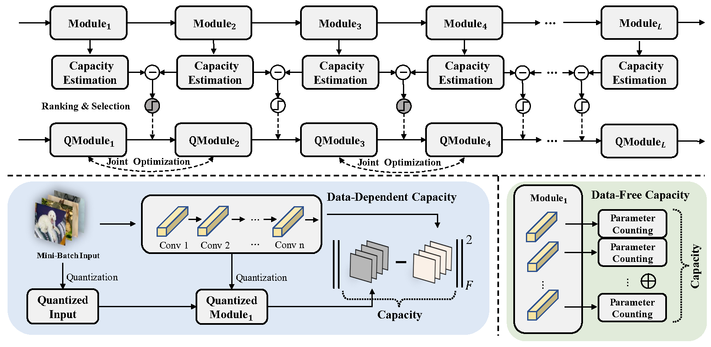

# Solving Oscillation Problem in Post-Training Quantization Through a Theoretical Perspective (CVPR 2023) ([Link](https://arxiv.org/abs/2303.11906))

## Overview




## Prerequisites

* Linux
* Python 3
* CPU or NVIDIA GPU + CUDA CuDNN

## Getting Started

### Requirements

- [MQBench](https://github.com/ModelTC/MQBench)
- pyyaml
- easydict


### Data preparation

- ImageNet

Add the imagenet path to the "data.path" in the config file.


### Run MRECG

- Run the following command to quantize the model using the MRECG algorithm, 
all yaml files can be found in ./config. You can change the bit width, batchsize, pre-trained model path and other quantization parameters in the yaml file.

  ```shell
  python ptq_main.py --config configs/qdrop/mbv2_2_4.yaml
  ```

### Results

| Method\Model| W/A  | Res18 | Res50 | MBV2×1.0 | MBV2×0.75 | MBV2×0.5 | MBV2×0.35 | Reg600M |
|  ----       | ---- | ----  |  ---- |   ----   |   ----    |   ----   |    ----   |   ----  |
| Full Prec.  |32/32 | 71.01 | 76.63 |   72.20  |   69.95   |   64.60  |    60.08  |   73.52 |
| Pretrained  | -    | [link](https://drive.google.com/file/d/1svSikgf3A2m_38IfGslprdFOIDu6sjRd/view?usp=sharing)  | [link](https://drive.google.com/file/d/1EI0IpREnp4eRieumjcl3QDbI7sfYypU8/view?usp=sharing)  |   [link](https://drive.google.com/file/d/1pl9jZ96CVqVan0AMoO0iMn8J4BToPoKq/view?usp=sharing)   |   [link](https://drive.google.com/file/d/1dpkySPyPGCeV-9CFLwBCe1fAW-_7d9Yo/view?usp=sharing)    |   [link](https://drive.google.com/file/d/10ZQ8hNhv1bzpfBPmKmMohyjYq99WGJ43/view?usp=sharing)   |    [link](https://drive.google.com/file/d/1_UUB7LQnv8iZJJH_nzLXWR0yKNAzW4_S/view?usp=sharing)   |   [link](https://drive.google.com/file/d/1YNWialt0ptHWfDPjIQRxoAuSYRcSyhK1/view?usp=sharing)  |
| Ours+BRECQ  | 4/4  | 69.06 | 74.84 |   68.56  |   64.55   |   55.26  |    50.67  |   -     |
| Ours+BRECQ  | 2/4  | 65.61 | 70.04 |   58.49  |   52.50   |   41.16  |    35.46  |   -     |
| Ours+BRECQ  | 3/3  | 65.64 | 70.68 |   57.14  |   50.21   |   35.11  |    30.26  |   -     |
| Ours+BRECQ  | 2/2  | 52.02 | 43.72 |   13.84  |   9.46    |   3.43   |    3.22   |   -     |
| Ours+QDROP  | 4/4  | 69.46 | 75.35 |   68.84  |   64.39   |   55.64  |    50.94  |   71.22 |
| Ours+QDROP  | 2/4  | 66.18 | 70.53 |   57.85  |   53.71   |   40.09  |    35.85  |   65.16 |
| Ours+QDROP  | 3/3  | 66.30 | 71.92 |   58.40  |   51.78   |   38.43  |    32.96  |   66.08 |
| Ours+QDROP  | 2/2  | 54.46 | 56.82 |   14.44  |   11.40   |   4.18   |    3.09   |   43.67 |

Due to the presence of random numbers in the experiment, the actual model accuracy may be slightly high or low.

## Acknowledgements

Our code relies on the [MQBench](https://github.com/ModelTC/MQBench) package.


## Reference

```latex
@article{ma2023solving,
  title={Solving Oscillation Problem in Post-Training Quantization Through a Theoretical Perspective},
  author={Yuexiao Ma and Huixia Li and Xiawu Zheng and Xuefeng Xiao and Rui Wang and Shilei Wen and Xin Pan and Fei Chao and Rongrong Ji},
  journal={arXiv preprint arXiv:2303.11906},
  year={2023}
}
```